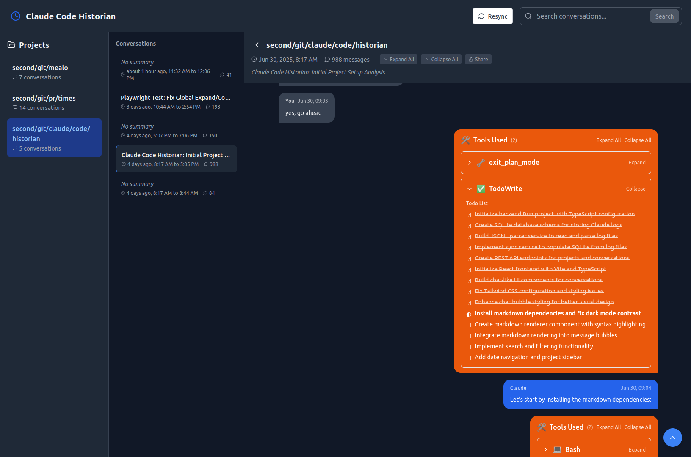

# Claude Code Historian

A dashboard to visualize and explore Claude's conversation logs.

Vibe coded with Claude Code, of course.

Features a Bun-powered backend with SQLite database and a React-based SPA frontend.

## Features

- 📁 Browse projects and conversations
- 💬 Chat-like UI inspired by messaging apps
- 🔧 Collapsible tool use visualization
- 🔍 Search across all conversations
- 🌍 Share self-contained HTML pages from your conversations

<div align="center">

</div>

## Prerequisites

- Bun (latest version)
- Claude logs in `~/.claude/` directory

## Getting Started

### 1. Backend Setup

```bash
cd backend
bun install

# First, sync your Claude logs to the database
bun run sync

# Start the API server
bun run start
```

The API will be available at http://localhost:3001

### 2. Frontend Setup

In a new terminal:

```bash
cd frontend
bun install
bun run dev
```

The frontend will be available at http://localhost:5173

## Architecture

### Backend
- **Bun + TypeScript**: Fast runtime and bundler
- **SQLite**: Local database using Bun's built-in SQLite module
- **Hono**: Lightweight web framework
- **Zod**: Schema validation

### Frontend
- **React + TypeScript**: UI framework
- **Vite**: Build tool
- **TailwindCSS**: Styling
- **React Query**: Data fetching and caching
- **Lucide React**: Icons

## API Endpoints

- `GET /api/projects` - List all projects
- `GET /api/projects/:projectId/conversations` - Get conversations for a project
- `GET /api/conversations/:conversationId` - Get conversation with messages
- `GET /api/search?q=<query>` - Search messages
- `GET /api/todos/:sessionId` - Get todos for a session

## Development

To re-sync logs after new conversations:
```bash
cd backend && bun run sync
```